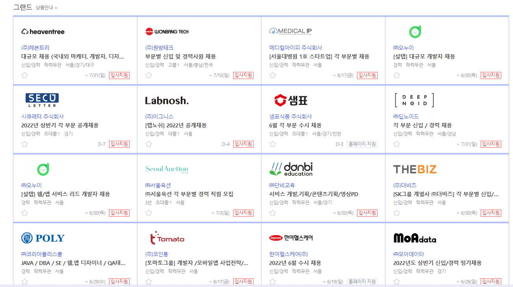
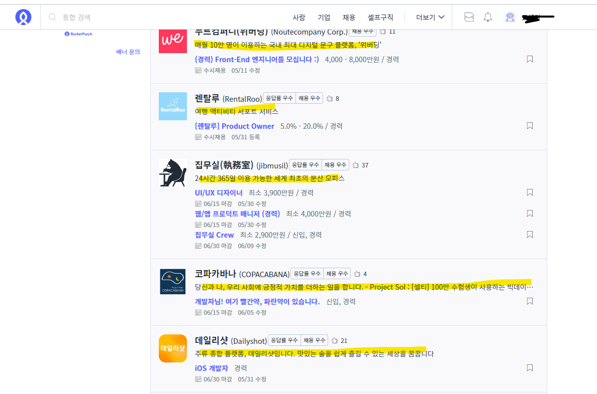
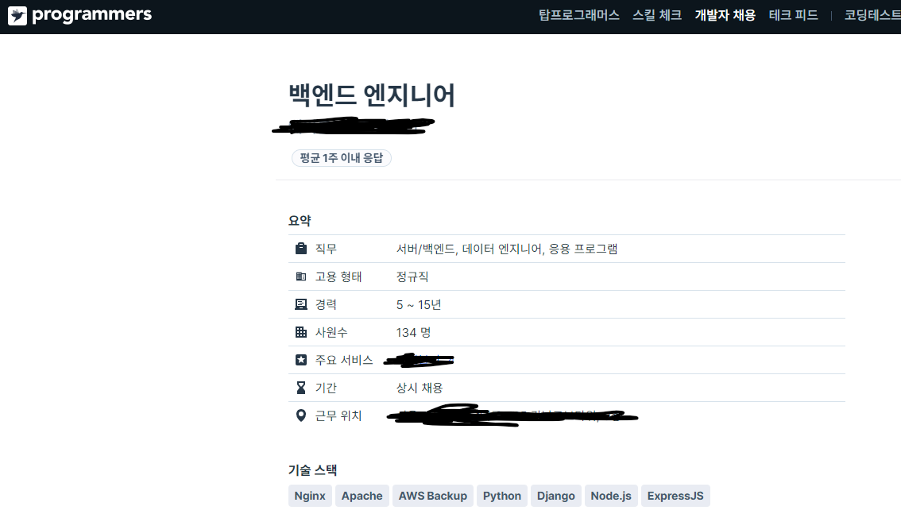

# 채용 공고의 공통된 자격요건 & 우대사항을 정리!

---

- my status

  - 신입
  - 사용가능 언어
    - HTML, CSS, Java
  - 학습 중인 언어
    - 자바스크립트, 파이썬, Mysql
  - 사용 경험
    - figma, 깃허브, 깃

---

## 1. 프론트엔드

### 1) 로켓펀치

#### (1) 실비아헬스 (Silvia Health)

#### # [주요 업무](https://www.rocketpunch.com/jobs/100791/프론트엔드-개발자-React#duty)

\- 실비아의 일반 고객 및 기관 고객을 위한 실비아 웹 서비스 개발
\- Storybook 기반 React Components Library 관리
\- NextJS기반 React App 관리
\- Github actions을 통한 CI/CD 관리

자격 요건
\- 학사 졸업 또는 졸업예정자
\- 1년 이상의` React` 개발 경력이 있거나 그에 준하는 실력을 갖추신 분
\- `JavaScript/TypeScript, Javascript Style`에 능숙하신 분
\- Web 및 모바일에 적합한 UI/UX을 위한 `Responsive Design` 에 전반적인 이해를 갖춘 분
\- `Git`을 통한 버전 관리에 능숙하신 분
\- `Redux, MobX, Recoil` 와 같은 Stage Management Tool을 다룰 수 있는 분
\- 자유로운 근무환경에서 스스로의 목표와 일정을 관리할 수 있는 분
\- 배움에 대한 열정을 갖고, 지속적이고 효과적으로 피드백을 주고 받는 분
\- 맡은 작업에 대한 오너십을 갖고, 이를 완성시키는 일에 열정이 있는 분

우대 사항
\- `React` 컴포넌트의 재사용을 기반으로 한 React-Native 개발 경험이 있는 분
\- 여러 국가에 걸쳐 서비스를 운영/배포한 경험이 있는 분
\- 모듈화, 테스트, 유지보수가 용이한 코드에 대한 이해를 갖춘 분
\- 단위테스트, 기능테스트, 종단테스트, 빌드 자동화, 지속적 통합의 경험이 있는 분
\- `NextJS `사용 경험이 있으신 분
\- `Apollo Graphql` 사용 경험이 있는 분
\- `Google Firebase 혹은 AWS Amplify` 사용 경험이 있는 분
\- `React-Native` 경험이 있으신 분
\- `CI/CD Tool (Travis, CircleCI, Github actions, etc.)` 효율적인 배포 관리 경험이 있는 분

---

### 2) 원티드

#### 1) 크리에이트립 (주니어 프론트엔드 엔지니어/산업기능요원가능) [링크](https://www.wanted.co.kr/wd/93677)

##### (1) 주요업무

• 크리에이트립 프로덕트 및 비즈니스 목적을 고려한 프론트엔드 개발
• 커머스 플랫폼으로 진화하는 크리에이트립 반응형 웹 및 어플리케이션 프로덕트를 개선합니다.

###### 자격요건

(필수) skillset

• 3년~5년 프론트엔드 개발 경력을 보유 하시거나 그에 준하는 실력을 보유하신분
• OOP에 대한 이해를 바탕으로 객체의 책임, 역할, 협력에 대해 고민하시는 분
• 다음 세 가지 프레임워크 중 최소 하나를 활용하여 서비스를 개발해 본 경험이 있으신 분: Node.js, React.js, React Native
• 산업기능요원의 경우 정보처리분야 보충역 혹은 현역으로 전직을 목표하시는 분 (현역 편입(신규) 채용 불가)

(필수) 마인드셋

• 글로벌 서비스에 대한 관심과 열정을 보유하신 분
• 한국의 트렌드가 글로벌로 성장하는 것에 공감하고 이에 대한 관심이 많으신 분
• 스스로의 역량을 한정짓지 않고 탁월한 성과를 기반으로 급진적인 성취와 성장, 보상을 추구하시는 분
• 다양한 백그라운드의 이해관계자들과 목표 지향적인 커뮤니케이션이 가능하신 분
• 스스로 문제를 정의하고 유저와 비즈니스를 함께 고려한 솔루션을 찾으려 노력하시는 분

###### 우대사항

• `스스로 서비스를 A-Z까지 기획하고 런칭`해 보신 분
• 속도 빠른 스타트업이나 애자일 조직을 경험해 보신 분
• `GraphQL, Apollo Client 서비스 개발` 경험이 있으신 분
• 애니메이션 및 인터렉션 등 유저가 느끼는 `UI/UX 디테일`에 대한 욕심이 있으신 분
• `SEO 정책`에 대한 이해도와 이를 통한 서비스 개발 경험이 있으신 분
• MultiLingual, i18n 을 이용한 다국어 서비스 경험이 있으신 분 (크리에이트립에 다국어가 정말 많습니다)

---

### 3) 프로그래머스

#### 1) 유비케어- 의료인 정보 포털 프론트 개발자 [링크](https://programmers.co.kr/job_positions/12112?by_theme=true)

##### (1) 주요업무

의료인을 위한 플랫폼 개발 사업에 주력하고 있으며, 현재 의료인 정보 포털 서비스를 개발 업무를 수행합니다.

• 의료인 포털 웹 페이지 개발 및 운영
• 의원 경영 정보 웹 서비스 고도화

###### 자격요건

[지원자격]
• 신입
• 초대졸(전문학사) 이상

[필요기술/지식 등]
• `html / css` 기초 역량이 있으신 분
• 모던 브라우저 동작에 대한 이해를 갖추신 분
• `JavaScript / TypeScript / C#`
• Vue.js / `React` / ASP.net

###### 우대사항

• 새 기술 학습을 즐기고 개발자 릴레이션을 좋아하시는 분
• `Git Flow, 코드리뷰, 짝 프로그래밍` 경험이 있으신 분
• `Azure Cloud`에 익숙하신 분
• `Full-Stack`을 지향하시는 분
• 원활한 커뮤니케이션 능력이 있으신 분
• 기획, 디자이너, 퍼블리셔와 협업 경험이 있으신 분
• `AdobeXD, Zeplin, Figma` 등의 디자인 협업 도구에 익숙하신 분

---

### 3) 잡플래닛

#### 1) Front-end/Back-end Engineer (Biz Dev) [링크](https://www.jobplanet.co.kr/job/search?q=%ED%81%B4%EB%9D%BC%EC%9A%B0%EB%93%9C%2C%20%ED%92%80%EC%8A%A4%ED%83%9D%2C%20%ED%94%84%EB%A1%A0%ED%8A%B8%2C%20%EB%B0%B1%EC%97%94%EB%93%9C&posting_ids%5B%5D=1232194)

##### (1) 주요업무

• 사내 솔루션을 이용하여 운영 환경에 맞춘 커스터마이징 개발 업무
\- 운영환경 UI변경에 대한 대응 개발
\- 유관 인프라와 인터페이스 연동 개발

###### 자격요건

(경력)
• 개발 경력 3년 이상 (최소 1년 이상의 웹개발 경험 필수)
• 컴퓨터 관련 전공자 또는 그에 상응하는 지식을 보유하신 분
• Java, SpringFramework, Javascript 활용 가능하신 분
• 형상관리 툴(Git, Github 등)을 활용한 소스 관리 경험이 있으신 분
• 지방으로 출장이 가능하신 분

`(신입)`
• 학사 이상 졸업 및 졸업 예정자(전공 무관)
• Linux 시스템에 대한 기본 지식이 있으신 분
• Front-end(HTML, CSS, JavaScript)에 대한 기본 지식이 있으신 분
• Back-end(Java, SpringFramework)에 대한 기본 지식이 있으신 분
• 지방으로 출장이 가능하신 분

##### 우대사항

(공통)
• Vue.js 활용 가능하신 분
• AWS, Azure, ncloud 등 퍼블릭 클라우드 환경을 사용하거나 활용이 가능하신 분
• OpenStack, Kubernetes 등 프라이빗 클라우드 환경을 사용하거나 활용이 가능하신 분
• 오픈소스 활용에 능숙하신 분
• 책임감이 투철하고 배우려는 열정을 보유하신 분
• 유연한 커뮤니케이션 능력을 보유하신 분

(신입)
• 컴퓨터 및 전산 관련 학과 전공자
• SpringBoot 기반의 Restful 서비스 개발이 가능하신 분
• JPA(Hibernate)를 통한 개발이 가능하신 분
• Confluence, Jira 등 협업 도구 사용 경험이 있으신 분

---

## 표로 보기

|                                                                                | 자격 요건                                                                                                                                                                                                                                                                                                           | 우대사항                                                                                                                                                                                                                                                                                                                                                                                                                |
| ------------------------------------------------------------------------------ | ------------------------------------------------------------------------------------------------------------------------------------------------------------------------------------------------------------------------------------------------------------------------------------------------------------------- | ----------------------------------------------------------------------------------------------------------------------------------------------------------------------------------------------------------------------------------------------------------------------------------------------------------------------------------------------------------------------------------------------------------------------- |
| 실비아헬스 (Silvia Health)(프)                                                 | \- 학사 졸업 또는 졸업예정자/ 1년 이상의` React` 개발 경력이 있거나 그에 준하는 실력- `JavaScript/TypeScript, Javascript Style`에 능숙하신 분/ Web 및 모바일에 적합한 UI/UX을 위한 `Responsive Design` 에 전반적인 이해를 갖춘 / `Git`을 통한 버전 관리에 능숙하신 분 /`Redux, MobX, Recoil` :Stage Management Tool | • `스스로 서비스를 A-Z까지 기획하고 런칭`해 보신 분• 속도 빠른 스타트업이나 애자일 조직을 경험해 보신 분• `GraphQL, Apollo Client 서비스 개발` 경험이 있으신 분• 애니메이션 및 인터렉션 등 유저가 느끼는 `UI/UX 디테일`에 대한 욕심이 있으신 분• `SEO 정책`에 대한 이해도와 이를 통한 서비스 개발 경험이 있으신 분• MultiLingual, i18n 을 이용한 다국어 서비스 경험이 있으신 분 (크리에이트립에 다국어가 정말 많습니다) |
| 유비케어(프)                                                                   | 초대졸(전문학사) 이상• `html / css` 기초 역량이 있으신 분 • 모던 브라우저 동작에 대한 이해를 갖추신 분 • `JavaScript / TypeScript / C#` • Vue.js / `React` / ASP.net                                                                                                                                    | • 새 기술 학습을 즐기고 개발자 릴레이션을 좋아하시는 분• `Git Flow, 코드리뷰, 짝 프로그래밍` 경험이 있으신 분• `Azure Cloud`에 익숙하신 분• `Full-Stack`을 지향하시는 분• 원활한 커뮤니케이션 능력이 있으신 분<• 기획, 디자이너, 퍼블리셔와 협업 경험이 있으신 분• `AdobeXD, Zeplin, Figma` 등의 디자인 협업 도구에 익숙하신 분                                                                                         |
| 풀                                                                             | 리눅스, 학사이상 (전공무관), Java, SpringFramework, Javascript 기본 이해,Git, Github 경험, Linux                                                                                                                                                                                                                    | vue.js 활용,퍼블릭 클라우드 (AWS,Azure, ncloud) 사용,오픈소스, 컴퓨터 및 전산관련 학과 전공, SpringBoot, JPA(Hibernate), Confluence, Jira,컴퓨터 및 전산관련 졸업                                                                                                                                                                                                                                                       |
| [카카오페이](https://www.jobkorea.co.kr/Recruit/GI_Read/38664323?rPageCode=SL) | 프론트엔드 환경에 대한 다양한 경험과 이해를 바탕으로 서비스 개발에 기여하실 분,React / Angular / Vue.js 등 SPA 환경에서 개발에 능숙한 분,모바일 앱 내 웹 페이지 개발 경험이 있으신 분,다양한 분야의 사람들을 이해하고 그들과 함께 원활히 협업하실 분,함께 성장하길 바라고 그 성장을 주변 동료와 함께 나누실 분      | \- 웹 뷰 환경에서의 다양한 개발 경험을 가지신 분 - 대고객 서비스 개발 및 운영 경험이 있으신 분                                                                                                                                                                                                                                                                                                                          |
| 공통                                                                           | 학사이상, javascript, react or angular or vue 개발                                                                                                                                                                                                                                                                  |                                                                                                                                                                                                                                                                                                                                                                                                                         |

## 2. 백엔드

|                                                                                                                                                                                                            | 자격조건                                                                                                                                                                                                                                                                                                                                                                                                                                                       | 우대사항                                                                                                                                                                                                                                                                                                                                                                                                                            |
| ---------------------------------------------------------------------------------------------------------------------------------------------------------------------------------------------------------- | -------------------------------------------------------------------------------------------------------------------------------------------------------------------------------------------------------------------------------------------------------------------------------------------------------------------------------------------------------------------------------------------------------------------------------------------------------------- | ----------------------------------------------------------------------------------------------------------------------------------------------------------------------------------------------------------------------------------------------------------------------------------------------------------------------------------------------------------------------------------------------------------------------------------- |
| [잡플래닛](https://www.jobplanet.co.kr/job/search?q=%EB%B0%B1%EC%97%94%EB%93%9C%2C%EB%B0%B1%EC%97%94%EB%93%9C%EA%B0%9C%EB%B0%9C%2C%ED%8C%8C%EC%9D%B4%EC%8D%AC%EA%B0%9C%EB%B0%9C&posting_ids%5B%5D=1232017) | • Python 개발 경험 • Python 기반 서버 개발 경험(Flask, Django, FastAPI) • AWS 사용 경험 (EC2, Lambda, SQS, Athena, CloudWatch ...) • 클라우드 기술 스택에 관심이 많으신 분 • 책임감이 강하신 분 • 주도적으로 자기 업무를 수행하시는 분 • 커뮤니케이션 능력이 탁월하고 설득력 있게 설명 가능하신 분                                                                                                                                     | • 광고 업무 이해 • Python 기반 서비스 운영 경험 • AWS 인프라 구성 및 운영 경험 • 클라우드 관련 자격증 소지자                                                                                                                                                                                                                                                                                                            |
| [프로그래머스](https://programmers.co.kr/job_positions/10584?by_theme=true)                                                                                                                                | • Node.js 혹은 Spring Boot, Spring Cloud 기반 개발 경험이 있는 분  • AWS 클라우드 기반 서비스 개발/운영 경험이 있는 분  • RDBMS, NoSQL, Redis 경험이 있는 분  • 논리적이고 체계적이며, 문제해결 능력을 보유한 분  • 서비스 가용성과 확장성을 고려한 시스템 아키텍처 설계 및 개발 능력을 보유한 분  • 적극적인 협업을 통해 함께 성장하길 원하는 분  • 변화를 두려워하지 않고 새로운 기술을 적극적으로 학습하며 꾸준히 성장할 수 있는 분 | • Java 개발 경험이 있는 분 우대 • MSA 기반 시스템 개발 경험이 있는 분 우대 • Docker, k8s 사용 경험이 있는 분 우대 • TDD 경험이 있는 분 우대 • DevOps 환경에서 배포 자동화, 모니터링 환경 구축 경험이 있는 분 우대 • 새로운 기술을 적극적으로 배워서 동료와 공유할 수 있는 분 우대 • 논리적이고 체계적인 문제해결 능력과 커뮤니케이션 능력을 보유한 분 우대 • 대용량 이커머스 서비스 경험이 있는 분 우대 |
| [로켓펀치](https://www.rocketpunch.com/jobs/127881/%EA%BE%B8%EB%8B%A4-%EC%84%9C%EB%B2%84%EB%B0%B1%EC%97%94%EB%93%9C-%EA%B0%9C%EB%B0%9C%EC%9E%90Back-End-Developer)                                         | • 웹/앱 개발, 운영을 5년 이상 하신 분 • Java/Kotlin 또는 Node.js(TypeScript)를 사용한 설계 및 개발이 능숙하신 분 • Spring Framework를 능숙하게 활용할 수 있으신분 • MySQL 등 RDBMS 또는 NoSQL 개발 경험이 있으신 분 • 더 나은 개발 환경과 팀을 만들기 위한 기술 스택(아키텍쳐, 프레임워크, 라이브러리)에 욕심이 있으신 분                                                                                                                      | • 초기 기획부터 참여하여, 개발, 운영, 모니터링 경험이 있으신 분 • 사용자의 문제를 정량적, 정성적 데이터로 파악하여 해결할 수 있으신 분 • 이커머스, 데이터 분석에 대한 지식 및 경험이 풍부하신 분 • 빌드,배포 자동화 경험이 있으신 분                                                                                                                                                                                    |
| [우아한 형제들 인재영입](https://career.woowahan.com/recruitment/R2205095/detail?jobCodes=BA007001&employmentTypeCodes=&serviceSectionCodes=&careerPeriod=&keyword=&category=jobGroupCodes%3ABA005001)     | \- 나이/성별/학력/전공 무관 \- 웹 에플리케이션과 HTTP API 개발에 익숙한 분 \- 단위/통합 테스트코드 작성이 가능하신 분 \- 다음 기술에 익숙하신 분 · JAVA (JDK 8 이상), Spring Framework, JPA · RDBMS, Redis · AWS (S3, SQS, SNS, RDS, Elasticache, Lambda 등) · Git · Jenkins                                                                                                                                                   | \- 적극적이고 밝은 자세로 동료들과 협업하며 프로덕트를 제안하고 만들어 갈 수 있는 분 \- 실시간 대규모 트래픽이나 대용량 데이터 처리가 가능하신 분 \- 이벤트 기반의 아키텍쳐 개발 및 운영 경험이 있으신 분                                                                                                                                                                                                                   |
| 공통                                                                                                                                                                                                       | java 혹은 python + Spring 혹은 node.js+ AWS                                                                                                                                                                                                                                                                                                                                                                                                                    | 운영 경험                                                                                                                                                                                                                                                                                                                                                                                                                           |

## 3. 극히 주관적인 결론...

- 필수 언어를 해야함 : 자바/자바스크립트/파이썬/
- 협업 중요시

- 잡플래닛, 프로그래머스, 로켓펀치, 원티드, ... 정말 많은 채용관련 사이트가 있음
- 사용해보면서 느낀점
  - 사람인: 개발자뿐만 아니라 다른 직종의 채용도 같이 포함 된거라서 그런지 한눈에 회사가 어떤 일을 하는 지 알기 어려움.

- 로켓펀치: 이점에서 로켓펀치는 공고를 클릭해서 들어가서 회사를 일일히 보기 전에 대략적으로 어떤 서비스를 제공하는 회사인지 알 수있음

  

- 프로그래머스 : 이름에서 알 수 있듯이 개발자들을 위한 채용사이트라서 그런지 알고 싶은 내용들이 제일 앞에 배치 (기술스택,응답률 등등)

  
