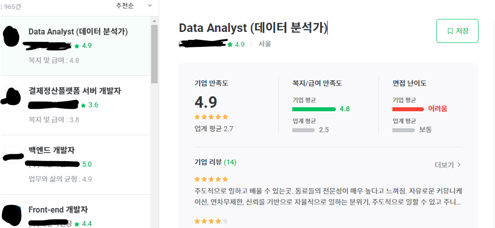

# 자기소개서 문항 분류하기!!

## 질문 모음 
**반복되는 주요질문으로 분류**

|                                                              | 질문 1                                                       | 질문 2                                                       |
| ------------------------------------------------------------ | ------------------------------------------------------------ | ------------------------------------------------------------ |
| [우아한형제들](https://career.woowahan.com/recruitment/R2205070/detail?category=jobGroupCodes%3ABA005001&jobCodes=BA007002&employmentTypeCodes=&serviceSectionCodes=&careerPeriod=&keyword=) | 경력기술서(PDF형식) 필수 첨부                                | 경력기술서는 자신의 기술력을 보여 줄 수 있는 프로젝트나 협력 했던 활동사항 위주로 작성해 주세요.  (진행기간, 주요업무내용, 본인이 기여한 기술력, 결과/성과/성취 등) |
| [LG CNS](https://www.jobkorea.co.kr/starter/PassAssay/View/239229?Page=1&OrderBy=0&FavorCo_Stat=0&schPart=10016&schWork=1&Pass_An_Stat=0) 웹프로그래머 | my competency 지원분야와 관련된 구체적인 지식이나 경험을 기술해주십시오. Guide > 관련학습, 동아리 확동, 수상경험 등을 중심으로 자유롭게 기재해주세요. | Why LG CNS? LG CNS에 지원한 동기와 입사 이후 꿈꾸는 것은 무엇입니까? Guide > 지원동기 : LG CNS에서 근무하고 싶은 이유, LG CNS를 알게 된 계기, IT또는 컴퓨터에 관심을 가지게 된 계기등. 꿈: 입사 이후 성장하고 싶은 목표 및 비전 등 |
| [네이버](https://www.jobkorea.co.kr/starter/PassAssay/View/237478?Page=2&OrderBy=0&FavorCo_Stat=0&schPart=10016&schWork=1&Pass_An_Stat=0) | 가장 자신 있는 또는 좋아하는 컴퓨터 공학 관련 이수 과목명과 성적, 그리고 해당 과목을 택한 이유를 각각 기재해 주세요 * 최대 6개까지 작성해주세요. *비전공자여서 학교에서 이수한 과목이 없을 경우, 개발자가 되기 위해 별도로 공부했던 컴퓨터 관련 학습내용을 작성해주세요. *작성예시:컴퓨터구조/A/컴퓨터 구조 전반에 대한 기본기를 탄탄하게 갖출 수 있는 수업이었습니다. #관심분야와의 연관성 #기본에 대한 관심 # 탄탄한 기본기 | 기술적으로 어려운 문제를 해결한 경험을 상세히 작성해 주세요 (학교수업/프로젝트/경진대회/대외활동 등) 맞닥뜨렸던 문제를 '구체'적으로 기술하고, 본인의 접근방법과 해결과정, 그리고 실제 결과를 '상세히'기술해 주세요. 문제를 잘 해결했다면 그 경험에서 아쉬운 점 혹은 더 나은 방법은 없었을 지에 대한 고민 과정을 함께 작성해 주세요. 해결하지 못한 경험이라도 해결을 위해 얼마나 깊이 있게 고민을 했는 지 그 과정에 대해 이야기 해주세요. *코드로 설명해주셔도 좋습니다. #해결 못한 경험도 좋아요 #과정을 보고 싶어요 |
| 삼성 SDS                                                     | 지원한 이유와 입사 후 회사에서 이루고 싶은 꿈을 기술하십시오 | 본인의 성장과정을 간략히 기술하되 현재의 자신에게 가장 큰 영향을 끼친 사건, 인물 등을 포함하여 기술하기 바랍니다 (작품 속 가상 인물도 가능) |
| [SK](https://www.jobkorea.co.kr/starter/PassAssay/View/201370?Page=3&OrderBy=0&FavorCo_Stat=0&schPart=10016&schWork=1&Pass_An_Stat=1) | KT 및 해당 직무에 지원한 동기와 KT에 입사 후 이루고 싶은 중장기적 목표를 기술해주세요 | 공동의 목표 달성을 위한 협업 경헙을 본인이 수행한 역할 중심으로 제시하고, 해당 겸험을 통해 무엇을 얻었는 지 기술해 주십시오. 지원직무 관련 주요 연구 및 업무 경험에 대해 구체적으로 기술해 주십시오. |

## 공통적인 질문

1. `경험`에 관한 질문
   1. 지원분야에 관한 경력 OR 지식 OR 학습 경험
      1. 협업경험, 담당업무 기술, 활동 사항 등등
   2. 문제 해결 (STAR)
      1. 성장`과정`, 문제 해결을 위한 `과정` => 과정 그 자체를 보기 위한 질문들
2. 지원 동기
   1. 해당 기업 혹은 직무에 지원하게 된 동기
   2. 앞으로의 목표와 연동된 질문
3. 앞으로의 `목표`
   1. 입사 후 하고 싶은 것

## 지극히 개인적인 채용관련 사이트 의견 part2

* 잡플래닛

  * 리뷰 면접 등등 정보가 잘 정리됨 but 멤버십 가입을 해야지 풀뷰 가능 

  * 워라벨 등 요즘 세대가 주목하는 회사 고르는 기준으로도 채용 회사 조회가능

    

* 링크드인
  * 현업 종사자의 프로필을 바로 볼 수 있음
  * 헤드헌터들이 프리랜서 찾을 때 쓸 거 같아서 신입인 필자는 해당 가능성이 낮을 듯